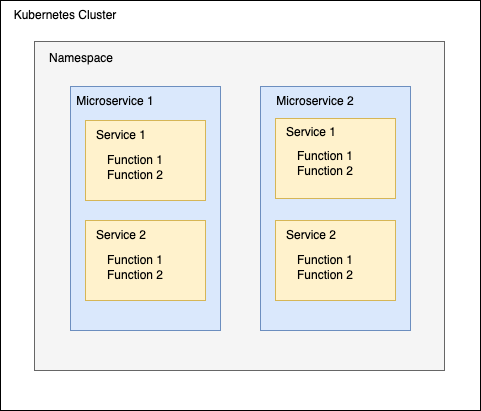

[![version][version-badge]][package]
[![Downloads][downloads]][package]
[![MIT License][license-badge]][license]

<h1 align="center">Backk<br/></h1>
<h2 align="center">Backends for Kubernetes</h2>
<h2 align="center">A Node.js framework for creating security-first cloud-native microservices for Kubernetes in Typescript</h2>
<h3 align="center">A task-oriented replacement for REST, GraphQL and RPC</h3>

## Table of Contents

- [Status](#status)
- [Features](#features)
- [Architecture](#architecture)
- [How Backk Works?](#howbackkworks)
- [Prerequisites](#prerequisites)
- [Get Started](#get-started)
- [Example Backk Microservice](#example-backk-microservice)
- [Usage Documentation](docs/USAGE_DOCUMENTATION.MD)
- [API Documentation](docs/API_DOCUMENTATION.MD)
- [Security Features](docs/SECURITY_FEATURES.MD)
- [OWASP TOP 10 Checklist](docs/OWASP_TOP_TEN_CHECKLIST.MD)
- [Feedback](#feedback)
  - [Report a Bug](#report-bug)
  - [Report a Security Vulnerability](#report-security-vulnerability)
  - [Request a New Feature](#request-new-feature)
  - [Request a Documentation Improvement](#request-documentation-improvement)
  - [Ask a Question](#ask-question)
- [Contributing](#contributing)
- [Sponsor](#sponsor)
- [License](#license)

## <a name="status"></a> Status

Backk is currently in beta phase. It might still contain some bugs, because everything is not 100% tested yet.
We are still working with a couple of features, namely backk-cli to generate new Backk microservice projects and distributed transactions with persistent sagas.
If you notice any problems or bugs, don't hesitate to submit an issue about that. See [Report a Bug](#report-bug). We are trying to address issues as fast as possible.
If you want/need any new features, please submit an issue about that. See [Request a New Feature](#request-new-feature).

## <a name="features"></a> Features

- Create synchronous and asynchronous microservices using
  - HTTP/1.1 or HTTP2
  - [Apache Kafka](https://kafka.apache.org/)
  - [Redis](https://redis.io/)
- Write your microservices using Typescript and plain functions that are called by remote clients
  - No need for learning any technology like REST, GraphQL or gRPC
  - Can be used both for resource and RPC style microservices
  - Optionally GraphQL syntax can be used to specify what fields are included in query responses
  - Backk does not really care if your microservice is really a microservice or more like a mini-service, macro-service or monolith.
- Supports subscription endpoints using Server Sent Events (SSE) in HTTP/1.1 and HTTP/2
- Supports different databases
  - [PostgreSQL](https://www.postgresql.org/)
  - [MySQL](https://www.mysql.com/)
  - [MongoDB](https://www.mongodb.com/)
  - [MariaDB](https://mariadb.org/)
  - [Vitess](https://vitess.io/) (MySQL compatible)
  - [YugabyteDB](https://www.yugabyte.com/) (PostgreSQL compatible)
  - [CockroachDB](https://www.cockroachlabs.com/) (PostgreSQL compatible)
- ORM (Object-relational mapper)
  - Entities
  - Comprehensive set of validations for all data types (number, string, Date, Arrays)
  - Drastically simplifies the definition of DTOs or totally removes the need for DTOs
- CLI for generating new Backk microservice projects
- Automatic database schema generation
- Recommended source code directory structure for creating uniform microservices
- Comprehensive set of NPM scripts from building and testing to Docker/Minikube/Helm management
- Easy access of remote Backk microservices
- Executing multiple service functions with one request
- Security
  - Builds distro-less non-root Docker images for the microservice
  - OAuth 2.0 Authorization support
  - Captcha verification support
  - Automatic password hashing using Argon2 algorithm
  - Automatic PII encryption/decryption
  - Mandatory validation using decorators is required for entity properties
    - e.g. string fields must have a maximum length validation and numbers must have minimum and maximum value validation
- Supports a response cache using Redis
- Distributed transactions with persistent sagas (This feature is coming soon)
- Automatic microservice documentation generation
  - [TypeDoc](https://typedoc.org/)
- Automatic microservice metadata/specification generation
  - [OpenAPI v3](https://swagger.io/docs/specification/about/)
  - Backk custom format that contains additional info compared to OpenAPI v3 spec
- Metadata endpoints can be called to retrieve microservice metadata for dynamic clients
- Automatic microservice integration test generation for [Postman](https://www.postman.com/) and [Newman](https://www.npmjs.com/package/newman)
- Automatic client code generation for Kubernetes cluster internal and web frontend clients
- Built-in Observability
  - Distributed tracing using OpenTelemetry API (Jaeger)
  - Log file format conforming to Open Telemetry specification
  - Metrics collection using OpenTelemetry API (Prometheus)
- Startup functions which are executed once on microservice startup
- Scheduled functions
  - Scheduled as per client request
  - Cron jobs
- Built-in Kubernetes Liveness, Readiness and Startup probes support
- Ready-made Dockerfiles
- Ready-made Docker Compose file setting up an integration testing environment
- Ready-made Helm templates for Kubernetes deployment
- Ready-made CI pipelines (currently only Github workflow)

## <a name="architecture"></a>Architecture
Backk microservices are cloud-native microservices running in a Kubernetes cluster. Microservices can run
in one or more namespaces.
One Backk microservice consists of service(s) which consist of service function(s).
These services and their functions comprise the API of your microservice.



For example, if your have Backk microservice
has service `emailNotificationService` and it has function `sendEmail`, that service function can be accessed with HTTP URL path `emailNotificationService.sendEmail`.
If your Backk microservice is named `notification-service` and is installed in default Kubernetes namespace, you can
access your service function over HTTP like this: `https://<kube-cluster-edge-fqdn>/notification-service.default/emailNotificationService.sendEmail`

## <a name="howbackkworks"></a> How Backk Works?
Backk microservices are written using Node.js and Typescript. A Backk microservice consists of one or more services classes with their dedicated purpose.
Each service class can contain one or more service functions (class methods) that implement the service functionality.
Each service function can have zero or exactly one parameter of JavaScript Class type. 
Service function returns a value, which can be `null`, a JavaScript value that can be converted to JSON or error.

Synchronously, Backk microservice can be accessed via HTTP. By default, each service function in the Backk microservice is accessible via HTTP POST method.
But it is possible to configure to access service functions via HTTP GET method.

Asynchronously, Backk microservices can be accessed via Kafka and/or Redis. In case of Kafka, Backk microservice reads messages
from a topic named after the microservice and message key tells the service function to execute and message value is the argument for the service function.
In case of Redis, Backk microservice uses a list named after the microservice and pops service function calls from the list.

It is possible to simultaneously access the Backk microservice both synchronously and asynchronously using any combinations of all the three communication methods: HTTP, Kafka and Redis

Let's have a short example to showcase accessing Backk microservice over HTTP.

Our microservice consist of one service `SalesItemService` that is for creating sales items and getting the created sales items, 
and it is using a MySQL database as a persistent data store.

Let's create the `SalesItemService` service interface in `src/services/salesitem` directory:

SalesItemService.ts
```ts
import { DefaultPostQueryOperationsImpl, Many, One, PromiseErrorOr, Service } from 'backk';
import SalesItem from './types/entities/SalesItem';

export interface SalesItemService extends Service {
  createSalesItem(salesItem: SalesItem): PromiseErrorOr<One<SalesItem>>;
  getSalesItems(postQueryOperations: DefaultPostQueryOperationsImpl): PromiseErrorOr<Many<SalesItem>>;
}
```

Let's create the `SalesItem` entity class in `src/services/salesitem/types/entities` directory:

SalesItem.ts
```ts
import { _Id, Entity, IsAscii, IsFloat, Length, MinMax, ReadWrite } from 'backk';

@Entity()
export default class SalesItem extends _Id {
  @IsAscii()
  @Length(1, 128)
  @ReadWrite()
  name!: string;
  
  @IsFloat()
  @MinMax(0, Number.MAX_VALUE)
  @ReadWrite()
  price!: number;
}
```

Let's create the service implementation class in `src/services/salesitem` directory:

SalesItemServiceImpl.ts
```ts
import { DataStore, DefaultPostQueryOperationsImpl, CrudEntityService, Many, One, PromiseErrorOr } from 'backk';
import { SalesItemService } from './SalesItemService';
import SalesItem from './types/entities/SalesItem';

export default class SalesItemServiceImpl extends CrudEntityService implements SalesItemService {
  constructor(dataStore: DataStore) {
    super({}, dataStore);
  }
  
  createSalesItem(salesItem: SalesItem): PromiseErrorOr<One<SalesItem>> {
    return this.dataStore.createEntity(SalesItem, salesItem);
  }
  
  getSalesItems(postQueryOperations: DefaultPostQueryOperationsImpl): PromiseErrorOr<Many<SalesItem>> {
    return this.dataStore.getAllEntities(SalesItem, postQueryOperations, false);
  }
}
```

Let's create the microservice implementation class in `src` directory and instantiate our sales item service:

microservice.ts
```ts
import { Microservice, MySqlDataStore } from 'backk';
import SalesItemServiceImpl from './services/salesitem/SalesItemServiceImpl'

const dataStore = new MySqlDataStore();

export default class MicroserviceImpl extends Microservice {
  private readonly salesItemService = new SalesItemServiceImpl(dataStore);
  // If you had other services in you microservice, you would instantiate them here

  constructor() {
    super(dataStore);
  }
}

const microservice = new MicroserviceImpl();
export default microservice;
```

Now we can create a new sales item with an HTTP POST request:
```
POST /salesItemService.createSalesItem
Content-Type: application/json

{
  "name": "Sales item 1",
  "price": 49.95
}
```

And we get a response containing the created sales item with `_id` assigned:
```
HTTP/1.1 200 OK
Content-Type: application/json

{
  "metadata": {}
  "data": {
    "_id": "1",
    "name": "Sales item 1",
    "price": 49.95
  }
}
```

Let's create another sales item:
```
POST /salesItemService.createSalesItem
Content-Type: application/json

{
  "name": "Sales item 2",
  "price": 89.95
}
```

And then we can get the created entities with an HTTP POST request to `salesItemService.getSalesItems`:
```
POST /salesItemService.getSalesItems
Content-Type: application/json

{
  "includeResponseFields": ["_id", "name"],
  "sortBys": [{ "fieldName": "_id", "sortDirection": "DESC" }],
  "paginations": [{ "pageNumber": 1, "pageSize": 2 }]
}
```

And the response will be:
```
HTTP/1.1 200 OK
Content-Type: application/json

{
  metadata: {}
  data: [
    {
      "_id": "2",
      "name": "Sales item 2"
    },
    {
      "_id": "1",
      "name": "Sales item 1"
    }
  ]
}
```

You can also use GraphQL style syntax in `includeResponseFields`:

```ts
const includeResponseFields = JSON.stringify([`
{
  _id
  name  
}
`]);
```

```
POST /salesItemService.getSalesItems
Content-Type: application/json

{
  "includeResponseFields": <value-from-above-includeResponseFields-variable>,
}
```

You can also achieve the same as above using `excludeResponseFields`:

```ts
const excludeResponseFields = JSON.stringify([`
{
  price  
}
`]);
```

```
POST /salesItemService.getSalesItems
Content-Type: application/json

{
  "excludeResponseFields": <value-from-above-excludeResponseFields-variable>,
}
```

You can also use just JSON instead of GraphQL query. This is an easier solution when you have the list of wanted
fields stored in Javascript object, then you can just use that object directly:

```ts
const includeResponseFields = JSON.stringify([
{
  _id: true,
  name: true  
}
]);
```

```
POST /salesItemService.getSalesItems
Content-Type: application/json

{
  "includeResponseFields": <value-from-above-includeResponseFields-variable>,
}
```

## <a name="prerequisites"></a> Prerequisites

1. [Node.js](https://nodejs.org/en/download/) >= 12.19
2. If your microservice uses a database, you need to install a local instance of the database. For the local database, use the default configuration for database port, username and password.
   You can also run a database in a container. For running a container in Mac or Windows, you need to install [Docker Desktop](https://www.docker.com/products/docker-desktop). You can use the same database installation for developing multiple Backk microservices. Backk will create a separate database/schema for each microservice. For local database installations:
   - [Download and install PostgreSQL](https://www.postgresql.org/download/) or [run PostgreSQL in a container](https://hub.docker.com/_/postgres)
   - [Download and install MySQL](https://www.mysql.com/downloads/) or [run MySQL in a container](https://hub.docker.com/_/mysql)
   - [Download and install MariaDB](https://mariadb.org/download/) or [run MariaDB in a container](https://hub.docker.com/_/mariadb)
   - [Download and install MongoDB](https://www.mongodb.com/try/download/community) or [run MongoDB in a container](https://hub.docker.com/_/mongo)
   - [Download and install Vitess](https://vitess.io/docs/get-started/local/) or [run Vitess in a container](https://vitess.io/docs/get-started/local-docker)
   - [Download and install CockroachDB](https://www.cockroachlabs.com/docs/stable/install-cockroachdb.html) or [run CockroachDB in a container](https://hub.docker.com/r/cockroachdb/cockroach)
   - [Download and install YugabyteDB](https://download.yugabyte.com/) or [run YugabyteDB in a container](https://hub.docker.com/r/yugabytedb/yugabyte)
3. If your microservice uses Kafka, you need to install a local instance of Kafka. You can use the same Kafka installation for developing multiple microservices. By default, each microservice will only consume messages from a topic named after the microservice. For local Kafka installation:
   - [Download and install Kafka](https://kafka.apache.org/downloads) or [run Kafka in a container](https://hub.docker.com/r/wurstmeister/kafka)
4. If your microservice uses Redis (as message queue and/or response cache), you need to install a local instance of Redis. You can use the same Redis installation for developing multiple microservices. By default, each microservice will only consume messages from a Redis list named after the microservice. For local Redis installation:
   - [Download and install Redis](https://redis.io/download) or [run Redis in a container](https://hub.docker.com/_/redis)

## <a name="get-started"></a> Get Started

Use [backk-cli](https://github.com/backk-node/backk-cli) to create a new Backk microservice project

## <a name="example-backk-microservice"></a> Example Backk Microservice

If you want to dive right into the deep end, check out the [backk example microservice](https://github.com/backk-node/backk-example-microservice) called Vitja.

Vitja is an example Backk microservice. It offers a full-featured digital second hand marketplace for users to sell their
second hand items. Users can add their own sales items and browse others' sales items. Users can follow other users, like their sales items and
follow sales items for price changes. Users can add/remove sales item to/from shopping cart and place orders.
Vitja will also track the order delivery and possible order return process.

## <a name="feedback"></a> Feedback

### <a name="report-bug"></a> Report Bug

If you find a bug, please [create a new bug report](https://github.com/backk-node/backk/issues/new/choose) about that

### <a name="report-security-vulnerability"></a> Report Security Vulnerability

If you find a security vulnerability, please [create a new bug report](https://github.com/backk-node/backk/issues/new/choose) about that

### <a name="request-new-feature"></a> Request New Feature

If you want to request a new feature or enhancement, please [create a new feature request](https://github.com/backk-node/backk/issues/new/choose) about that

### <a name="request-documentation-improvement"></a> Request Documentation Improvement

If you want to request an improvement to documentation, please [create a new documentation improvement request](https://github.com/backk-node/backk/issues/new/choose) about that

### <a name="ask-question"></a> Ask Question

If you want to ask a question

- submit your question to [Stack Overflow](https://stackoverflow.com/questions/ask) and remember to use tag _'backk'_
- [create a new issue](https://github.com/backk-node/backk/issues/new/choose) for your question

## <a name="contributing"></a> Contributing

If you are first time contributing to any open source project, you can check these tutorials:

- [first-contributions](https://github.com/firstcontributions/first-contributions)
- [Step-by-step guide to contributing on GitHub](https://www.dataschool.io/how-to-contribute-on-github/)

You can contribute to Backk open-source project in following ways:

- Fixing open bugs
  - [List of all open bugs](https://github.com/backk-node/backk/issues?q=is%3Aopen+is%3Aissue+label%3Abug)
  - [Lst of open bugs that are good first issues](https://github.com/backk-node/backk/issues?q=is%3Aopen+is%3Aissue+label%3Abug+label%3A%22good+first+issue%22)
- Implement new features and enhancements
  - [List of open new feature requests](https://github.com/backk-node/backk/issues?q=is%3Aopen+is%3Aissue+label%3Aenhancement)
- Improve documentation
  - [List of open documentation improvement requests](https://github.com/backk-node/backk/issues?q=is%3Aopen+is%3Aissue+label%3Adocumentation)
- Answer Backk related questions
  - [Stack Overflow](https://stackoverflow.com/questions/tagged/backk?tab=Unanswered)
  - [List of unanswered questions](https://github.com/backk-node/backk/issues?q=is%3Aopen+is%3Aissue+label%3Aquestion)
- Write unit tests
- Refactoring
  - Proper naming of function
  - Proper naming of function arguments and function variables
  - Function is split to multiple functions if it is long
  - Typescript types are restrictive enough (avoid 'any' type)
  - Optimization
  - Readability

You can request to assign a certain issue to yourself by [creating an issue assignment request](https://github.com/backk-node/backk/issues/new/choose)

## <a name="sponsor"></a>Sponsor

## <a name="license"></a>License

MIT License

[license-badge]: https://img.shields.io/badge/license-MIT-green
[license]: https://github.com/backk-node/backk/blob/master/LICENSE
[version-badge]: https://img.shields.io/npm/v/backk.svg?style=flat-square
[package]: https://www.npmjs.com/package/backk
[downloads]: https://img.shields.io/npm/dm/backk
